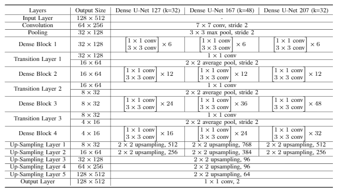
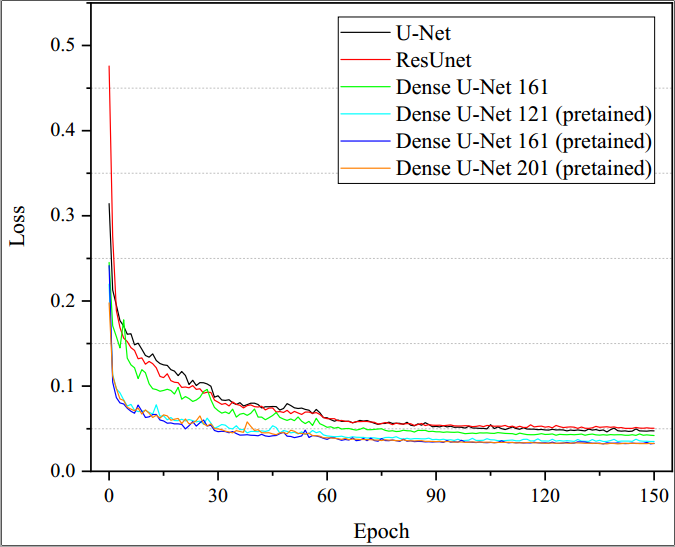
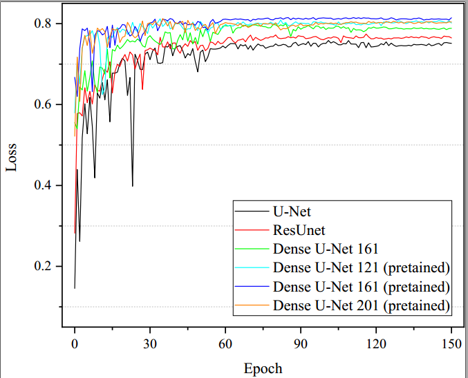

# dense-unet

This is a dense-unet segmentation architecture based on pretained dense net. 

We created three dense-unet architecture based on DenseNet121, DenseNet161 and DenseNet201, the details of the proposed dense-unet is listed in the following:



We test U-Net, Res-Unet, DenseUnet121, DenseUnet161, DenseUnet201 in this project, training loss and validation dice similarity coeficient are shown below:






# usage

```python 
python train.py --save ./work/super/test
```
